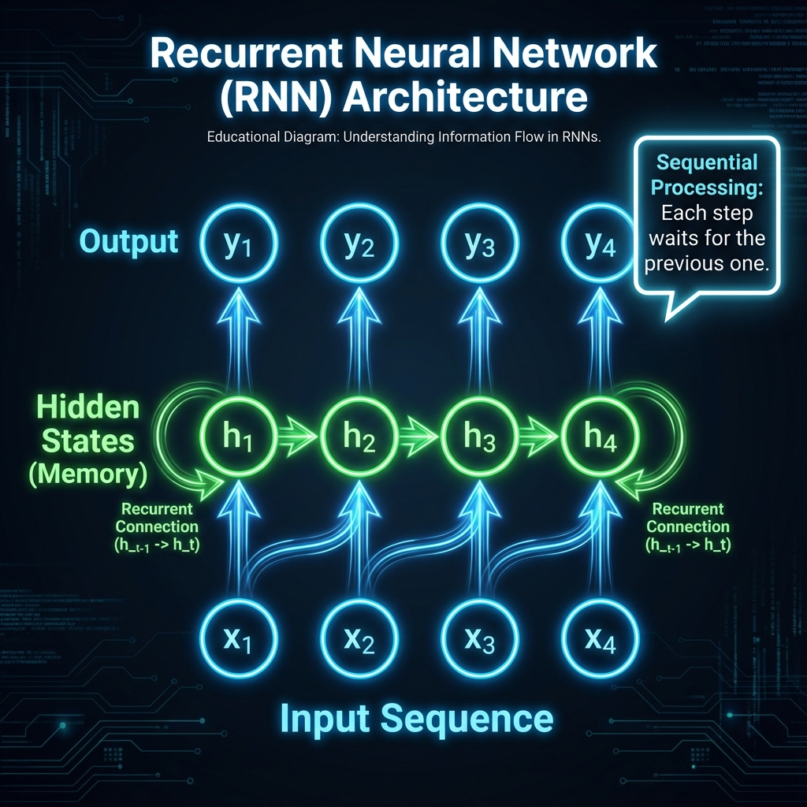
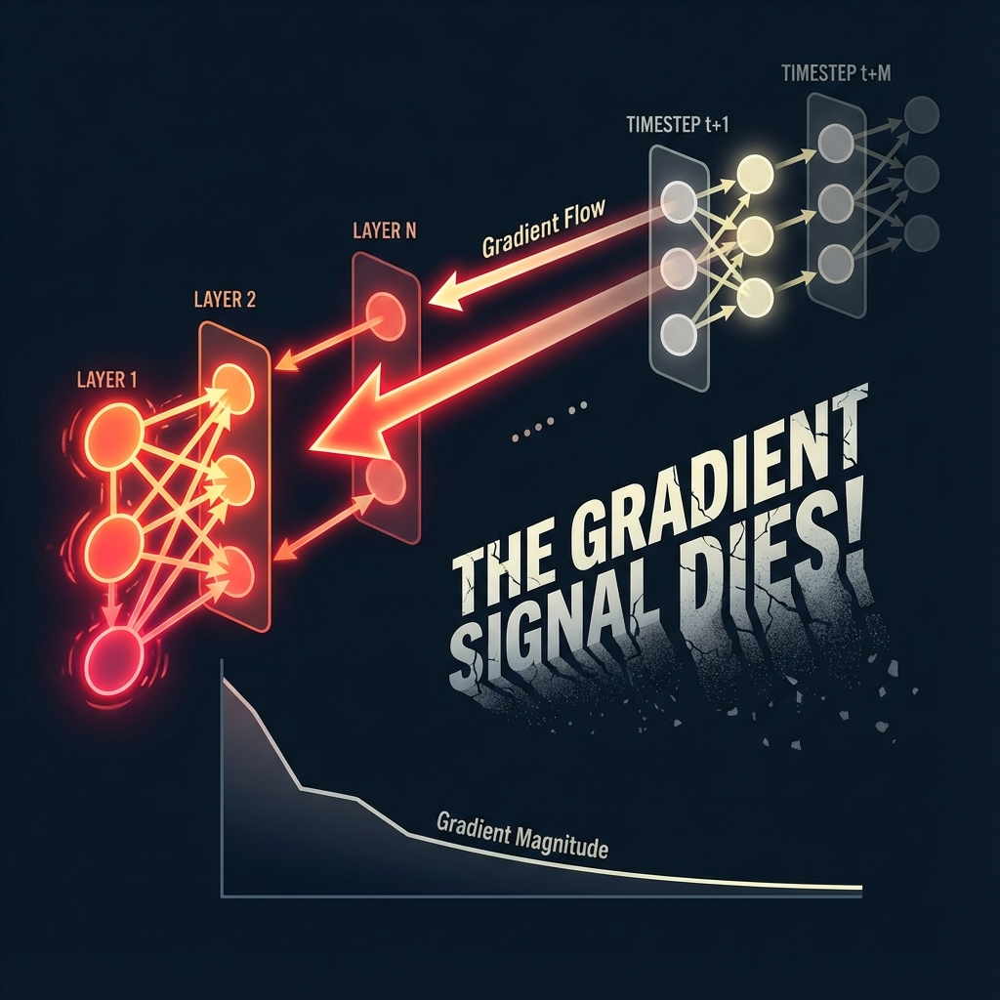

# 🧠 From RNNs to Transformers: The Complete Neural Journey

> **Your Learning Path**: RNN Basics → Gradient Problems → LSTMs → Attention → Transformers
> 
> **Time Investment**: ~25 minutes of deep reading
> 
> **Prerequisite**: Basic understanding of neural networks (layers, weights, backpropagation)

---

## 📚 Chapter 1: Recurrent Neural Networks (RNNs) - The Foundation

### 🤔 Why Do We Need RNNs?

Regular neural networks (like MLPs) have a fatal flaw: **they have no memory**.

Imagine trying to predict the next word in a sentence:
- Input: "The cat sat on the ___"
- A regular NN sees each word independently. It doesn't know "cat" came before "sat".

**RNNs solve this by passing information from one step to the next.**

---

### 🏗️ RNN Architecture Explained



**Visual Breakdown:**
1. **Input Layer (x₁, x₂, x₃...)**: Each word in your sentence, converted to a vector
2. **Hidden State (h₁, h₂, h₃...)**: The "memory" that carries forward
3. **The Magic Arrow →**: At each step, the hidden state is passed to the next step

**The Core Equation:**
```
h_t = tanh(W_hh * h_{t-1} + W_xh * x_t + b)
```

**Plain English:**
- `h_t` = The new hidden state (new memory)
- `h_{t-1}` = The previous hidden state (old memory)
- `x_t` = The current input word
- `W` = Learnable weights (the "brain")

**🍌 The Key Insight**: The hidden state `h` is like a **conveyor belt** carrying information through time. Each new word updates the belt.

---

### 🐌 Problem #1: RNNs Are Slow

**Why?** Look at the architecture again. To compute `h₄`, you MUST first compute:
1. `h₁` (from x₁)
2. `h₂` (from h₁ + x₂)
3. `h₃` (from h₂ + x₃)
4. Finally, `h₄` (from h₃ + x₄)

**This is SEQUENTIAL.** You can't parallelize it. GPUs cry. 😭

---

## 💀 Chapter 2: The Vanishing Gradient Problem - Why RNNs Forget

This is the **fatal flaw** that killed vanilla RNNs for long sequences.

### 🔬 What Happens During Backpropagation?

When training, gradients flow backward through time:
- From output → last hidden state → previous hidden state → ... → first hidden state



**The Math Behind the Death:**

At each timestep, the gradient gets multiplied by the weight matrix `W_hh`.

```
∂Loss/∂h₁ = ∂Loss/∂h₄ × (∂h₄/∂h₃) × (∂h₃/∂h₂) × (∂h₂/∂h₁)
```

Each `∂hₜ/∂hₜ₋₁` term includes multiplying by `W_hh` and the derivative of `tanh`.

**Problem:** 
- If `|W_hh| < 1`: Gradients **shrink** exponentially → **Vanishing Gradient**
- If `|W_hh| > 1`: Gradients **explode** exponentially → **Exploding Gradient**

**🍌 Real-World Impact:**
- Sentence: "The dog that I saw at the park with my friend who lives in Brooklyn was ___ ."
- By the time the RNN reaches the blank, it has **forgotten** "dog" was the subject!
- The gradient from the loss can't effectively update the early weights.

---

### 🩹 The Attempted Fix: LSTMs & GRUs

**Long Short-Term Memory (LSTM)** networks added "gates" to control information flow:
- **Forget Gate**: What to delete from memory
- **Input Gate**: What new info to add
- **Output Gate**: What to reveal

**Did they work?** Partially! LSTMs can handle sequences of ~200-500 tokens. But they're still sequential (slow) and still struggle with very long documents.

---

## ⚡ Chapter 3: The Transformer Revolution - "Attention Is All You Need"

### 🎯 The Core Question

> "What if we could look at ALL words AT THE SAME TIME instead of one-by-one?"

This is the genius of the Transformer.

---

### 🔥 Self-Attention Mechanism


**How It Works:**

For each word, we ask: "How much should I pay attention to every other word?"

1. **Query (Q)**: "I am looking for..."
2. **Key (K)**: "I contain information about..."
3. **Value (V)**: "Here is my actual content..."

**The Attention Equation:**
```
Attention(Q, K, V) = softmax(Q × Kᵀ / √d_k) × V
```

**Plain English:**
1. Compare each Query to all Keys (dot product)
2. Normalize with softmax (so attention weights sum to 1)
3. Use these weights to grab relevant Values

**🍌 Why This Fixes Everything:**

| Problem | RNN | Transformer |
|---------|-----|-------------|
| Speed | Sequential (slow) | Parallel (FAST!) |
| Long-range deps | Gradient dies | Direct connection |
| Memory | Limited by hidden size | O(n²) attention matrix |

---

### 🧱 The Full Transformer Architecture

```
Input Embedding + Positional Encoding
           ↓
    ┌─────────────────┐
    │ Multi-Head      │ ← Multiple attention patterns in parallel
    │ Self-Attention  │
    └─────────────────┘
           ↓
    ┌─────────────────┐
    │ Feed-Forward    │ ← Process each position independently
    │ Network         │
    └─────────────────┘
           ↓
    (Repeat N times - "Layers")
           ↓
        Output
```

**Key Innovation - Positional Encoding:**
Since we process all words simultaneously, we lose order information. 
Solution: Add a unique "position signal" to each word embedding using sin/cos functions.

---

## 🎓 Chapter 4: Interview-Ready Takeaways

### ⚡ Quick Recall Cards

**Q: Why did RNNs fail for long sequences?**
> A: Vanishing gradients. During backprop, gradients decay exponentially through time.

**Q: What's the time complexity of self-attention?**
> A: O(n²) where n is sequence length. Each word attends to all others.

**Q: Why is positional encoding needed?**
> A: Self-attention is permutation invariant. Without it, "dog bites man" = "man bites dog".

**Q: Trade-off between RNN and Transformer?**
> A: RNN: O(n) memory, sequential. Transformer: O(n²) memory, parallel.

---

## 🔗 Further Reading

1. **Original Paper**: [Attention Is All You Need](https://arxiv.org/abs/1706.03762)
2. **Illustrated Transformer**: Jay Alammar's visual guide
3. **The Annotated Transformer**: Harvard NLP's code walkthrough

---

*Generated by Super-Learning Neural Architect 🧠*
