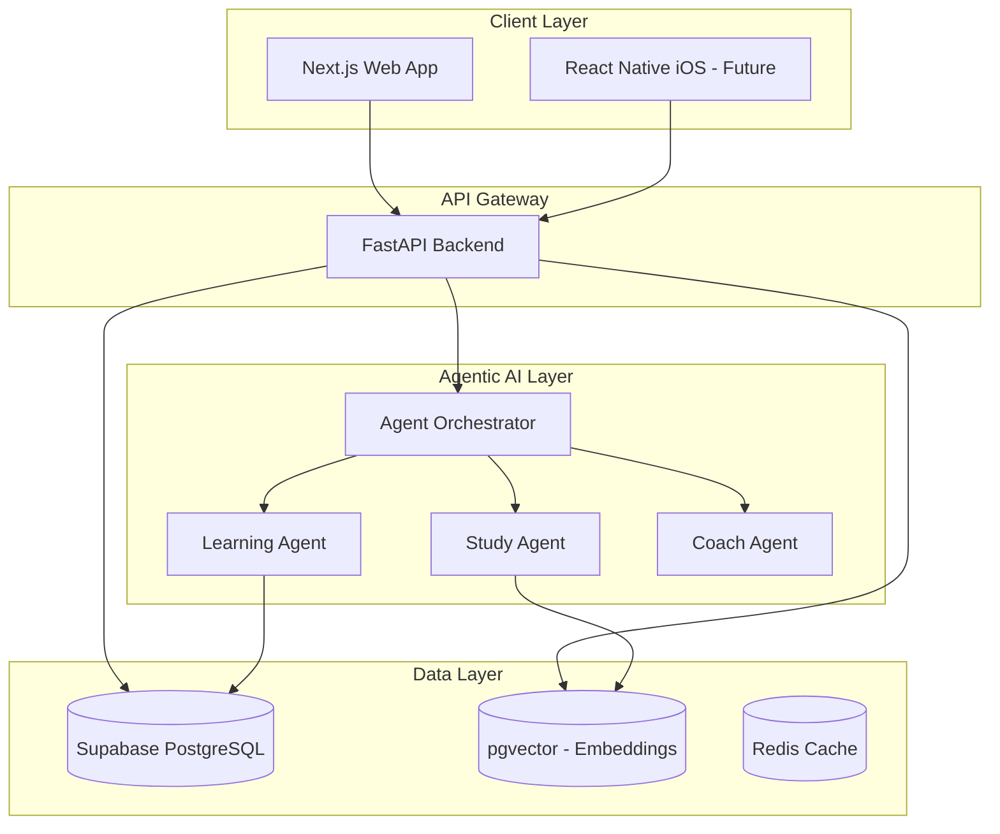

# Super-Learning Platform: World-Class Redesign

## Overview

Transform the existing YouTube note generator into a **comprehensive AI-powered learning platform** with agentic AI architecture, supporting web and future iOS deployment.

> [!IMPORTANT]
> This is a major architectural redesign. The scope includes new database, new frontend stack, and agentic AI integration.

---

## User Review Required

1. **Technology Stack Confirmation**:
   - **Database**: Supabase (PostgreSQL + pgvector for AI embeddings)
   - **Backend**: FastAPI (Python) - maintains your existing investment
   - **Frontend**: Next.js 14 with React - for web, future React Native for iOS
   - **AI**: Google Gemini 2.5 Pro with multi-agent architecture

2. **Scope Clarification**: Is this platform exclusively for YouTube learning, or does it expand to include the "Life OS" features from your previous conversations (Workout, Nutrition, Habits, Reading, etc.)?

3. **Deployment Target**: Vercel (frontend) + Render/Railway (backend) + Supabase (database)?

---

## Architecture Overview



---

## Proposed Changes

### Component 1: Database Schema (Supabase)

Design for agentic AI accessibility - all features share unified data models.

#### [NEW] Database Schema

```sql
-- Core User Management
CREATE TABLE users (
    id UUID PRIMARY KEY DEFAULT gen_random_uuid(),
    email TEXT UNIQUE NOT NULL,
    created_at TIMESTAMPTZ DEFAULT NOW(),
    preferences JSONB DEFAULT '{}'
);

-- Content Sources (YouTube videos, articles, books)
CREATE TABLE content_sources (
    id UUID PRIMARY KEY DEFAULT gen_random_uuid(),
    user_id UUID REFERENCES users(id),
    source_type TEXT NOT NULL, -- 'youtube', 'article', 'book'
    source_url TEXT,
    title TEXT NOT NULL,
    metadata JSONB DEFAULT '{}',
    created_at TIMESTAMPTZ DEFAULT NOW()
);

-- Generated Notes
CREATE TABLE notes (
    id UUID PRIMARY KEY DEFAULT gen_random_uuid(),
    source_id UUID REFERENCES content_sources(id),
    user_id UUID REFERENCES users(id),
    content TEXT NOT NULL,
    note_type TEXT NOT NULL, -- 'stanford', 'dsa', 'podcast', 'cheatsheet'
    created_at TIMESTAMPTZ DEFAULT NOW()
);

-- AI Embeddings for Semantic Search (pgvector)
CREATE TABLE embeddings (
    id UUID PRIMARY KEY DEFAULT gen_random_uuid(),
    note_id UUID REFERENCES notes(id),
    chunk_text TEXT NOT NULL,
    embedding vector(768), -- Gemini embedding dimension
    created_at TIMESTAMPTZ DEFAULT NOW()
);

-- Agent Memory (Long-term learning patterns)
CREATE TABLE agent_memory (
    id UUID PRIMARY KEY DEFAULT gen_random_uuid(),
    user_id UUID REFERENCES users(id),
    agent_type TEXT NOT NULL, -- 'learning', 'study', 'coach'
    memory_type TEXT NOT NULL, -- 'preference', 'pattern', 'insight'
    content JSONB NOT NULL,
    created_at TIMESTAMPTZ DEFAULT NOW()
);

-- Indexes for performance
CREATE INDEX idx_notes_user ON notes(user_id);
CREATE INDEX idx_embeddings_vector ON embeddings USING ivfflat (embedding vector_cosine_ops);
CREATE INDEX idx_agent_memory_user ON agent_memory(user_id, agent_type);
```

---

### Component 2: Backend API (FastAPI)

#### [MODIFY] [main.py](file:///Users/rj/youtube_notes/app/main.py)

Restructure to support agentic architecture:

```
app/
├── main.py                    # FastAPI app initialization
├── api/
│   ├── v1/
│   │   ├── __init__.py
│   │   ├── routes/
│   │   │   ├── auth.py        # Authentication endpoints
│   │   │   ├── content.py     # Content source management
│   │   │   ├── notes.py       # Note generation & retrieval
│   │   │   ├── agents.py      # Agent interaction endpoints
│   │   │   └── search.py      # Semantic search
│   │   └── dependencies.py    # Shared dependencies
├── agents/
│   │   ├── orchestrator.py    # Multi-agent coordinator
│   │   ├── learning_agent.py  # Note generation agent
│   │   ├── study_agent.py     # Study assistance agent
│   │   └── coach_agent.py     # Learning coach agent
├── db/
│   │   ├── supabase.py        # Supabase client
│   │   └── repositories/      # Data access layer
├── services/
│   │   ├── youtube.py         # YouTube extraction (existing)
│   │   ├── llm.py             # LLM service (existing)
│   │   └── embeddings.py      # Vector embeddings
└── core/
    ├── config.py              # Environment configuration
    └── logger.py              # Logging (existing)
```

---

### Component 3: Web Frontend (Next.js)

#### [NEW] Next.js Project Structure

```
web/
├── app/
│   ├── layout.tsx             # Root layout with design system
│   ├── page.tsx               # Landing page
│   ├── (auth)/
│   │   ├── login/page.tsx
│   │   └── signup/page.tsx
│   ├── dashboard/
│   │   ├── page.tsx           # Main dashboard
│   │   ├── notes/page.tsx     # Notes library
│   │   └── study/page.tsx     # Study assistant
│   └── api/                   # API routes (BFF)
├── components/
│   ├── ui/                    # Design system components
│   │   ├── Button.tsx
│   │   ├── Card.tsx
│   │   ├── Input.tsx
│   │   └── ...
│   ├── features/
│   │   ├── NoteGenerator.tsx
│   │   ├── StudyChat.tsx
│   │   └── CoachPanel.tsx
│   └── layout/
│       ├── Header.tsx
│       ├── Sidebar.tsx
│       └── Footer.tsx
├── lib/
│   ├── api.ts                 # API client
│   └── supabase.ts            # Supabase client
├── styles/
│   ├── globals.css            # Design tokens & CSS variables
│   └── design-system.css      # Component styles
└── package.json
```

---

### Component 4: Design System

Cross-platform design tokens for web and future iOS:

```css
:root {
  /* Colors - Premium Dark Mode */
  --color-bg-primary: #0a0a0b;
  --color-bg-secondary: #141416;
  --color-bg-tertiary: #1c1c1f;
  
  --color-accent-primary: #6366f1;    /* Indigo */
  --color-accent-secondary: #8b5cf6;  /* Purple */
  --color-accent-gradient: linear-gradient(135deg, #6366f1 0%, #8b5cf6 100%);
  
  --color-text-primary: #fafafa;
  --color-text-secondary: #a1a1aa;
  --color-text-muted: #71717a;
  
  /* Typography */
  --font-family: 'Inter', -apple-system, BlinkMacSystemFont, sans-serif;
  --font-mono: 'JetBrains Mono', 'Menlo', monospace;
  
  /* Spacing */
  --space-xs: 4px;
  --space-sm: 8px;
  --space-md: 16px;
  --space-lg: 24px;
  --space-xl: 32px;
  
  /* Radii */
  --radius-sm: 6px;
  --radius-md: 12px;
  --radius-lg: 16px;
  --radius-full: 9999px;
  
  /* Shadows */
  --shadow-sm: 0 1px 2px rgba(0, 0, 0, 0.3);
  --shadow-md: 0 4px 12px rgba(0, 0, 0, 0.4);
  --shadow-glow: 0 0 20px rgba(99, 102, 241, 0.3);
  
  /* Animations */
  --transition-fast: 150ms ease;
  --transition-normal: 250ms ease;
}
```

---

## Agentic AI Architecture

### Multi-Agent System Design

| Agent | Role | Capabilities |
|-------|------|--------------|
| **Orchestrator** | Coordinator | Routes requests, manages agent collaboration |
| **Learning Agent** | Note Generation | Creates deep-comprehension notes from content |
| **Study Agent** | Q&A Assistance | Answers questions using generated notes + embeddings |
| **Coach Agent** | Personalization | Tracks progress, suggests learning paths |

### Agent Memory Design

```python
# Long-term memory stored in database
class AgentMemory:
    user_preferences: dict      # Learning style, topics of interest
    learned_patterns: list      # Recurring concepts user struggles with
    session_insights: list      # Key insights from recent sessions
```

---

## Verification Plan

### Automated Tests

1. **Backend API Tests**
   ```bash
   cd /Users/rj/youtube_notes
   pytest tests/ -v
   ```
   > Note: Need to create `tests/` directory with pytest fixtures

2. **Database Schema Validation**
   ```bash
   # Run Supabase migrations
   supabase db push
   supabase db test
   ```

### Browser Testing

1. **Note Generation Flow**
   - Navigate to dashboard
   - Enter YouTube URL
   - Select note type (Stanford/DSA/Podcast)
   - Click Generate → Verify notes render correctly
   - Verify notes are saved to database

2. **Study Assistant**
   - Open Study Chat
   - Ask question about generated notes
   - Verify AI responds with relevant context

### Manual Verification

1. **User to verify**: Design system looks premium and consistent
2. **User to verify**: UX flows are intuitive on both desktop and mobile
3. **Performance**: Page load time < 2 seconds

---

## Implementation Order

1. **Phase 1**: Set up Supabase database with schema
2. **Phase 2**: Restructure FastAPI backend with new endpoints
3. **Phase 3**: Create Next.js project with design system
4. **Phase 4**: Implement core features (note generation, dashboard)
5. **Phase 5**: Add agentic AI layer (agents + embeddings)
6. **Phase 6**: Testing and deployment

---

## Questions for User

1. Should I proceed with creating the Supabase database schema first?
2. Do you have an existing Supabase project, or should I provide setup instructions?
3. For the design, do you prefer the dark premium aesthetic shown above, or a different direction?
4. Is the scope limited to YouTube learning, or should I plan for Life OS expansion?
