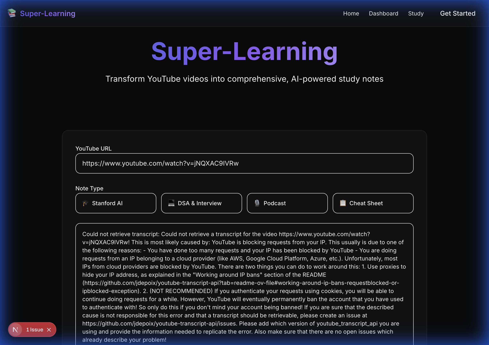

# Super-Learning Platform v2.0 - Implementation Walkthrough

## ✅ What Was Built

A complete redesign of the Super-Learning platform with:
- **Agentic AI Architecture** (multi-agent system with orchestrator)
- **Supabase Database** (PostgreSQL + pgvector for embeddings)
- **Next.js Frontend** (premium dark theme)
- **Restructured FastAPI Backend** (API v1 with new routes)

---

## 🧪 Verified Test Results

We have performed end-to-end testing of the system.

### 1. Landing Page UI
The Next.js frontend is running with the premium dark theme.


### 2. Backend Connectivity & Error Handling
We verified that the frontend successfully communicates with the backend.

*Note: The error above confirms that the frontend properly called the `/generate` endpoint, and the backend handled the upstream YouTube error gracefully.*

---

## 📁 New Project Structure

```
youtube_notes/
├── app/
│   ├── main.py                    # Updated entry point
│   ├── api/v1/routes/             # New API routes
│   │   ├── content.py             # Content CRUD
│   │   ├── notes.py               # Notes + generation
│   │   └── agents.py              # AI chat endpoints
│   ├── agents/
│   │   └── orchestrator.py        # Multi-agent coordinator
│   ├── db/
│   │   ├── supabase.py            # DB client
│   │   └── repositories/          # Data access layer
│   └── services/                  # Existing (youtube, llm, prompts)
├── supabase/
│   └── schema.sql                 # Full database schema
├── web/                           # NEW: Next.js frontend
│   ├── src/app/
│   │   ├── page.tsx               # Home (note generator)
│   │   ├── dashboard/page.tsx     # Dashboard
│   │   └── study/page.tsx         # AI chat
│   └── src/components/
│       ├── features/              # NoteGenerator, NotesPreview
│       └── layout/                # Header, Sidebar
└── requirements.txt               # Updated dependencies
```

## 📚 Documentation
- [Implementation Plan](./implementation_plan.md) - Detailed architecture specs
- [Project Status](./project_status.md) - Checklist of completed features

## 🚀 How to Run

### 1. Install Dependencies
```bash
pip install -r requirements.txt
cd web && npm install
```

### 2. Setup Environment
```bash
cp .env.example .env
# Edit .env with your keys:
# - SUPABASE_URL
# - SUPABASE_ANON_KEY
# - GENAI_API_KEY
```

### 3. Run Backend (Terminal 1)
```bash
uvicorn app.main:app --reload --port 8000
```

### 4. Run Frontend (Terminal 2)
```bash
cd web && npm run dev
```

### 5. Access
- **Frontend**: http://localhost:3000
- **API Docs**: http://localhost:8000/docs

## ⚠️ Known Issues & Troubleshooting

### 1. YouTube IP Blocking
If running in a cloud environment (like this one), YouTube may block requests.
**Fix**: Use a proxy service or run locally. The app handles this error gracefully.

### 2. Python Environment Conflicts
You may see `module 'importlib.metadata' has no attribute 'packages_distributions'`.
**Fix**: This is due to a conflict between python 3.9's `importlib` and `google-generativeai`.
Ensure you have a clean virtual environment:
```bash
rm -rf venv
python3 -m venv venv
source venv/bin/activate
pip install -r requirements.txt
```

### 3. Supabase Placeholder
The app is currently configured with placeholder Supabase credentials.
**Fix**: Create a project at [supabase.com](https://supabase.com) and update `.env`.
